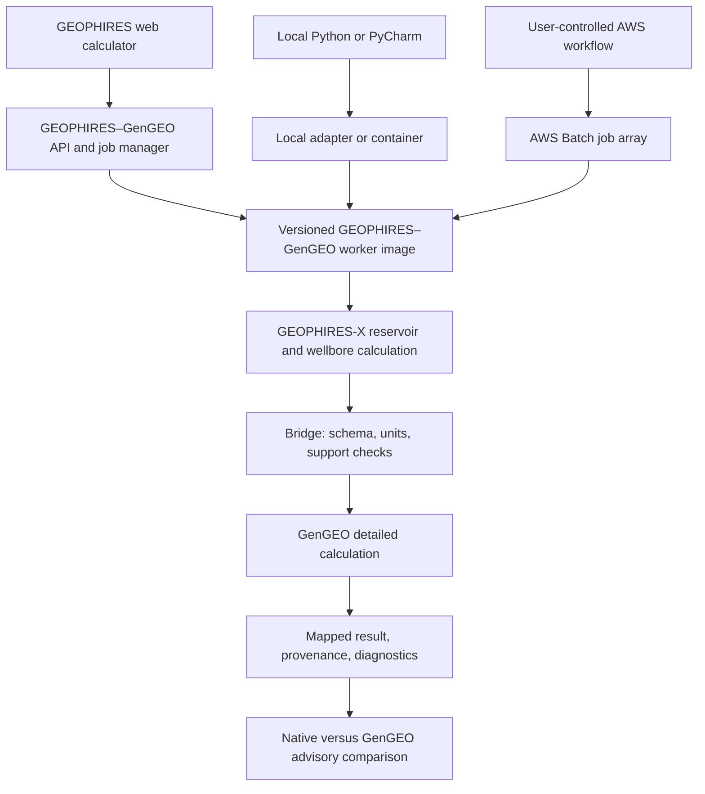

# Proposal: Optional GEOPHIRES–GenGEO Integration

## Purpose

This proposal describes a possible community-led integration between **GEOPHIRES-X** and **GenGEO**, two open-source geothermal techno-economic modeling tools with overlapping but different strengths.

The objective is not to merge the two codebases. The objective is to explore whether GEOPHIRES-X can optionally use selected GenGEO calculations for higher-fidelity surface-plant, thermodynamic-cycle, and cost modeling while preserving GEOPHIRES-X as the primary project model and public user interface.

The proposed approach is modular, optional, open source, web-service compatible, Monte Carlo capable, and portable across public hosting, local execution, and user-controlled cloud environments.

## Summary recommendation

The recommended architecture is a **containerized GEOPHIRES–GenGEO execution worker** behind a stable, versioned request/result contract.

The same worker should support three deployment modes:

1. the existing public GEOPHIRES calculator service;
2. local execution from Python, PyCharm, or a local container;
3. scalable batch execution in a user-controlled environment such as AWS Batch.

The initial modeling scope should remain narrow:

- electricity-only;
- water-based ORC first;
- advisory comparison mode first;
- native GEOPHIRES-X results remain authoritative by default;
- unsupported cases fall back cleanly to native GEOPHIRES-X.

However, **Monte Carlo and batch execution should be MVP requirements**, not future enhancements. Monte Carlo is central to project analysis, teaching, research, uncertainty quantification, and cloud-scale GEOPHIRES use.

The GenGEO bridge should also be treated as a possible first implementation of a modest external-engine interface rather than a permanently special-purpose connection.

## Why this is worth considering

GEOPHIRES-X is a broad techno-economic simulator. It combines reservoir, wellbore, surface-plant, direct-use, power-generation, and economic models across many geothermal applications. Its strengths are breadth, scenario coverage, extensibility, public accessibility, and community familiarity.

GenGEO is narrower in scope but appears to provide more detailed thermodynamic-cycle and bottom-up cost calculations for selected electricity-generation cases, especially water-based ORC and CO₂-plume geothermal configurations.

The opportunity is therefore not “which model replaces the other?” but rather:

> Can GEOPHIRES-X provide the project framework and public interface while optionally delegating selected detailed plant and cost calculations to GenGEO through a reproducible execution service?

If successful, users would gain:

- fast native GEOPHIRES-X calculations for screening and broad scenario analysis;
- optional GenGEO-backed calculations for supported electricity cases;
- side-by-side comparison of simplified and higher-fidelity assumptions;
- public browser access without local installation;
- reproducible local and cloud execution using the same modeling worker;
- scalable Monte Carlo analysis without redesigning the integration.

## Alignment with community trends

Recent geothermal research has emphasized standardized, multi-scale, and multi-physics workflows that combine complementary methods rather than expecting a single monolithic model to address every part of geothermal assessment. The paper *Towards a multi-physics multi-scale approach of deep geothermal exploration* provides a relevant example of this direction and highlights the value of coordinating specialized models across scales and physical domains.

The proposed GEOPHIRES-X / GenGEO integration is narrower than the exploration workflow discussed in that paper, but follows the same interoperability principle: specialized tools retain their scientific focus while exchanging information through defined, versioned interfaces.

The intended outcome is not to declare GEOPHIRES-X the mandatory platform for other models. Rather, it is to make GEOPHIRES-X more capable of participating in modular community workflows while preserving independent governance, scientific transparency, and user choice.

## Relationship to the existing SAM integration

The SAM / PySAM integration in GEOPHIRES-X is a useful precedent, but the GenGEO case is different.

SAM is primarily used as a downstream financial-modeling engine. GEOPHIRES-X can calculate technical performance, pass outputs to SAM, and receive financial results.

GenGEO would sit closer to the engineering core. It could augment selected surface-plant, thermodynamic-cycle, and cost calculations before final economics. That makes the integration more sensitive to boundary conditions, units, supported plant modes, result semantics, runtime dependencies, and Monte Carlo performance.

For that reason, the GenGEO integration should use an explicit execution contract and a separately managed worker runtime rather than a simple ad hoc function call.

## Core architectural principle

The web service, local user, and AWS batch deployment should all invoke the **same versioned execution worker and schemas**.



The public hosted service is therefore one deployment of an open-source execution system, not the only place where the integration can run.

## Proposed execution modes

### Public hosted service

The existing GEOPHIRES calculator should become the easiest entry point for ordinary users.

A user could select:

- native GEOPHIRES-X;
- GenGEO detailed calculation;
- compare native GEOPHIRES-X and GenGEO.

Small deterministic runs may be handled interactively. Larger Monte Carlo runs should be asynchronous jobs with status, progress, downloadable results, and resource limits.

### Local execution

Advanced users should be able to run the same model from PyCharm, the command line, or a local container.

Local execution supports:

- offline use;
- confidential studies;
- teaching environments;
- local Monte Carlo;
- exact reproduction of hosted results.

The local interface may call the worker as a package or container, but should use the same request/result schema as the hosted service.

### User-controlled cloud execution

Researchers and project teams should be able to run the same worker in their own AWS accounts or institutional cloud environments.

For AWS, the reference implementation should support:

- AWS Batch job arrays;
- S3 input and output storage;
- chunked realization processing;
- retries and resume behavior;
- optional Spot capacity;
- fixed container image versions;
- deterministic random seeds;
- result aggregation.

This allows large studies without forcing users to send confidential or expensive jobs through the public service.

## Monte Carlo as an MVP requirement

Monte Carlo is a primary use case, not an optional optimization.

The worker should avoid starting and initializing GenGEO for every realization. Instead, each worker process should initialize once and process a chunk of realizations.

```text
Worker starts
  -> loads GEOPHIRES-X, bridge, and GenGEO once
  -> processes realizations 1 through N
  -> writes a result bundle
  -> exits
```

For example, a 40,000-realization study could be divided into 200 jobs of 200 realizations each. The chunk size should be configurable based on runtime, memory, and failure-recovery needs.

The MVP should include:

- reproducible random seeds;
- configurable chunk size;
- persistent initialization within a worker;
- local multicore execution;
- batch execution contract;
- partial-failure detection;
- retry and resume support;
- raw realization results;
- aggregate statistics;
- provenance for every result bundle.

Threads should not be assumed safe. Independent worker processes or containers are preferred unless GenGEO is explicitly shown to be thread-safe.

## GenGEO modernization workstream

The current GenGEO repository documents an older Python and dependency environment. A public hosted integration should not depend indefinitely on that legacy runtime.

A one-time modernization effort should therefore be included near the beginning of the project.

Recommended modernization scope:

1. upgrade GenGEO to a currently supported Python version, initially targeting Python 3.11;
2. add a standard `pyproject.toml` package definition;
3. update and lock supported versions of SciPy, pandas, CoolProp, and other dependencies;
4. remove or isolate legacy spreadsheet dependencies where practical;
5. expose a stable programmatic API for supported calculations;
6. eliminate reliance on mutable module-level state, fixed filenames, repository-relative paths, and shared temporary files;
7. make model instances safe for independent parallel worker processes;
8. add deterministic batch-oriented entry points;
9. add cross-platform and containerized regression tests;
10. document numerical equivalence or expected numerical changes relative to the legacy version.

The preferred outcome is a modernized GenGEO release maintained with, or accepted by, the GenGEO community. If upstream adoption is not immediately available, the project may need a clearly identified compatibility fork or bridge-specific branch, with governance and maintenance responsibilities made explicit.

## Proposed integration boundary

The initial integration boundary should remain after GEOPHIRES-X has computed the reservoir and wellbore state but before final surface-plant and economic reporting.

| Scope item | Initial recommendation |
|---|---|
| End use | Electricity only |
| Plant type | Water-based ORC first |
| Calculation mode | Advisory side-by-side comparison |
| Authoritative result | Native GEOPHIRES-X by default |
| Unsupported cases | Explicitly report unsupported and fall back to native GEOPHIRES-X |
| Monte Carlo | Required in MVP |
| Public deployment | Existing hosted GEOPHIRES calculator |
| Scalable deployment | Container worker and AWS Batch reference path |
| Later expansion | CO₂ direct-power, selected cost override, explicit override mode |

Direct heat, district heating, heat pumps, absorption chillers, flash plants, CHP configurations, and other advanced GEOPHIRES-X cases should remain native unless a clear GenGEO mapping is later approved.

## Proposed execution contract

A lightweight interface could be introduced conceptually as:

```python
class DetailedPlantEngine:
    def supports(self, request) -> SupportResult:
        """Return whether the requested case is supported."""

    def evaluate(self, request: DetailedEngineRequest) -> DetailedEngineResult:
        """Run one deterministic case."""

    def evaluate_batch(self, request: DetailedBatchRequest) -> DetailedBatchResult:
        """Run a reproducible chunk of Monte Carlo or parameter-sweep cases."""
```

The bridge should own GEOPHIRES-X-to-GenGEO mappings. GEOPHIRES-X core and the public web calculator should not import GenGEO internals directly.

The contract should include:

- schema version;
- execution mode;
- units;
- input provenance;
- random seed and sampling metadata;
- chunk identifier;
- worker and container version;
- GEOPHIRES-X version;
- GenGEO version or commit;
- bridge version;
- warnings and unsupported-mode reasons.

## Web-service behavior

The public service should distinguish between interactive and batch workloads.

### Interactive endpoint

Suitable for:

- one deterministic run;
- native-versus-GenGEO comparison;
- very small Monte Carlo studies.

### Asynchronous job endpoint

Suitable for:

- large Monte Carlo studies;
- parameter sweeps;
- classroom workloads;
- long-running analyses.

The asynchronous interface should support:

- job submission;
- job status;
- progress reporting;
- cancellation where practical;
- durable result storage;
- downloadable CSV and JSON outputs;
- expiration and retention policy;
- quotas and rate limits;
- clear error reporting.

Unlimited anonymous cloud Monte Carlo should not be assumed. The public service may reasonably offer free deterministic and small batch runs while directing large studies toward authenticated quotas or bring-your-own-cloud deployment.

## AWS reference architecture

A practical reference deployment could use:

- a container registry such as GitHub Container Registry or Amazon ECR;
- the existing web-service platform or ECS/Fargate for API and interactive jobs;
- AWS Batch for large Monte Carlo job arrays;
- S3 for inputs, intermediate bundles, and outputs;
- a job-status database or existing service database;
- CloudWatch for logs and metrics;
- GitHub Actions for image build, testing, and publication;
- Terraform, AWS CDK, or another open infrastructure-as-code implementation.

The reference deployment should not require that all users adopt AWS. The container and schema should remain portable to other clouds, institutional clusters, and local systems.

## Advisory mode before override mode

The first working release should not replace native GEOPHIRES-X calculations. It should report:

- native GEOPHIRES-X result;
- GenGEO-backed result;
- absolute and percentage deltas;
- mapping assumptions;
- warnings and unsupported fields;
- runtime and version provenance.

Only after regression testing and community review should an explicit override mode be considered.

## Licensing and dependency posture

GEOPHIRES-X is MIT-licensed. GenGEO is LGPL-licensed. This does not prevent interoperation, but it argues against casually copying GenGEO into GEOPHIRES-X core.

The recommended posture is:

- keep the GenGEO codebase and license identity clear;
- keep the bridge and worker open source;
- publish source corresponding to distributed worker images;
- avoid making hosted execution the only access path;
- provide local and user-controlled deployment options;
- document all third-party dependencies and versions;
- conduct a formal license review before production distribution.

This proposal is not legal advice.

## Technical risks

| Risk | Concern | Mitigation |
|---|---|---|
| Legacy runtime | Current GenGEO environment is old for public hosting | Modernization workstream and regression testing |
| Unit mismatch | GEOPHIRES-X accepts flexible user units | Canonical SI bridge schema with explicit conversion tests |
| Unsupported mode drift | GEOPHIRES-X covers more end uses than GenGEO | Narrow supported-mode matrix and explicit fallback |
| Numerical differences | Simplified and detailed models may diverge | Advisory mode, golden cases, documented assumptions |
| Monte Carlo overhead | Reinitializing GenGEO for every realization wastes compute | Persistent worker initialization and chunked batches |
| Parallel safety | Shared mutable state could corrupt results | Independent processes or containers and concurrency tests |
| Public cloud cost | Anonymous large jobs could create uncontrolled expense | Quotas, rate limits, async jobs, and bring-your-own-cloud path |
| Reproducibility | Hosted, local, and AWS results could drift | Same worker image, schemas, seeds, and compatibility matrix |
| Maintenance burden | Multiple repositories and release cadences | Explicit ownership, pinned compatibility, CI, and release policy |
| Over-generalization | A universal plugin system could become too abstract | Implement only abstractions demonstrated by the GenGEO MVP |

## Testing strategy

The integration should have its own test suite covering:

1. request and result schema validation;
2. unit conversions;
3. supported and unsupported mode detection;
4. deterministic golden cases;
5. native-versus-GenGEO delta reports;
6. legacy-versus-modernized GenGEO regression cases;
7. batch reproducibility from fixed random seeds;
8. chunking invariance, where equivalent studies produce equivalent results regardless of chunk size;
9. retry and resume behavior;
10. local multicore execution;
11. container execution;
12. hosted API smoke tests;
13. AWS Batch reference-deployment smoke tests;
14. failure modes, timeouts, invalid thermodynamic states, and partial result bundles.

## Proposed MVP

The first milestone should be a **web-capable, Monte Carlo-capable compare-only MVP**.

Required deliverables:

- modernized GenGEO runtime on a supported Python version;
- versioned request/result schemas;
- containerized GEOPHIRES–GenGEO worker;
- water-based ORC support;
- deterministic advisory comparison;
- Monte Carlo batch interface;
- persistent initialization within each worker;
- local multicore execution;
- asynchronous web-job interface;
- public calculator integration for deterministic and appropriately limited batch runs;
- AWS Batch reference deployment;
- raw and aggregated outputs;
- explicit unsupported-mode fallback;
- version and provenance reporting.

Success criteria:

- at least three deterministic golden cases run locally and through the hosted-service path;
- a representative Monte Carlo study runs reproducibly locally and on AWS Batch;
- changing chunk size does not materially change statistical results;
- failed chunks can be retried without rerunning successful chunks;
- unsupported cases remain native GEOPHIRES-X;
- hosted, local, and AWS runs use the same worker image and schemas;
- numerical differences from legacy GenGEO are understood and documented;
- no GenGEO dependency is required for users who select native GEOPHIRES-X only.

## Proposed GitHub workflow

This effort should continue as a discussion PR before full project formalization.

Once the community agrees to proceed, enable Issues and create scoped work items for:

- GenGEO modernization;
- supported-mode matrix;
- request/result schemas;
- container worker;
- Monte Carlo and chunking;
- hosted-service integration;
- AWS reference deployment;
- golden cases and regression tests;
- licensing and governance;
- documentation and public release.

A GitHub Project becomes useful once these workstreams have owners and accepted scope.

## Decision requested from the community

The requested decision is whether the GEOPHIRES-X community is interested in exploring an open-source, web-capable, Monte Carlo-capable GenGEO integration built around a portable execution worker.

The decision includes whether the community supports:

- a one-time GenGEO modernization effort;
- the public GEOPHIRES calculator as the primary public deployment;
- local and user-controlled cloud deployment as equal open-source access paths;
- Monte Carlo and AWS portability as MVP requirements;
- GenGEO as the first implementation of a modest external-engine contract.

If yes, the next step is to define the supported-mode matrix, modernization acceptance tests, schemas, deployment boundary, and ownership model before production implementation.

## Initial open questions

1. Who currently operates and maintains the hosted GEOPHIRES calculator, and what deployment constraints already exist?
2. Should the worker image contain both GEOPHIRES-X and GenGEO, or should the service orchestrate separate images?
3. Can the GenGEO community accept and maintain the modernization changes upstream?
4. What Python version should be the first supported target?
5. Which existing GEOPHIRES-X examples should become deterministic and Monte Carlo golden cases?
6. What Monte Carlo chunk sizes and concurrency limits are appropriate for local and hosted execution?
7. What free public-service limits are reasonable?
8. Should large public-web studies export a ready-to-run AWS package or submit directly into a user-owned AWS account?
9. What retention, privacy, and confidentiality policies are needed for hosted studies?
10. Which GenGEO outputs could later be eligible for explicit override mode?
11. Who owns long-term worker-image, bridge, and cloud-reference maintenance?
12. What is the minimum reusable external-engine abstraction that supports this work without prematurely designing a universal plugin system?

## Recommendation

Proceed with a web-service-oriented but deployment-neutral design.

Build a modernized, containerized GenGEO execution worker that serves the existing GEOPHIRES web calculator, supports efficient Monte Carlo through persistent chunked workers, and can run unchanged on a laptop, in the public hosted service, or in a user's AWS account.

Do not make the public service the only execution path. Open source availability requires that the same worker remain runnable locally and in user-controlled infrastructure.

## References

- Darnet, M., Vedrine, S., Bretaudeau, F., et al. (2026). *Towards a multi-physics multi-scale approach of deep geothermal exploration*. **Geothermal Energy**. https://doi.org/10.1186/s40517-026-00392-7
- GEOPHIRES-X repository and documentation: https://github.com/NatLabRockies/GEOPHIRES-X
- GenGEO repository: https://github.com/GEG-ETHZ/genGEO
