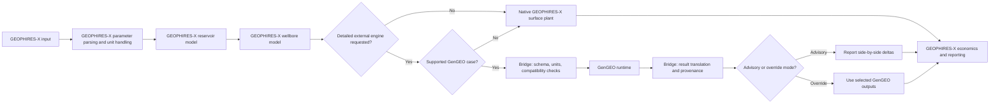

# Proposal: Optional GEOPHIRES–GenGEO Integration

## Purpose

This proposal describes a possible community-led integration between **GEOPHIRES-X** and **GenGEO**, two open-source geothermal techno-economic modeling tools with overlapping but different strengths.

The objective is not to merge the two codebases. The objective is to explore whether GEOPHIRES-X can optionally use selected GenGEO calculations for higher-fidelity surface-plant, thermodynamic-cycle, and cost modeling while preserving GEOPHIRES-X as the main orchestration framework.

The proposed approach is intentionally modular, optional, and staged so that the GEOPHIRES-X community can evaluate the concept without disrupting existing users, workflows, tests, or licensing assumptions.

## Summary recommendation

A GEOPHIRES-X / GenGEO integration appears feasible if it is treated as an **optional external bridge**, not as a direct source-code merge.

The recommended architecture is:

1. GEOPHIRES-X remains the primary project model orchestrator.
2. GenGEO remains a separate codebase and runtime.
3. A small GEOPHIRES-X hook exposes selected boundary conditions after reservoir and wellbore calculations.
4. A separate bridge layer converts GEOPHIRES-X state into a canonical GenGEO request.
5. GenGEO runs only for supported cases.
6. Results are returned to GEOPHIRES-X in a typed, auditable result object.
7. The initial mode is advisory side-by-side comparison, not automatic replacement.

This allows GEOPHIRES-X to retain its current behavior by default while giving advanced users a path to request more detailed calculations where GenGEO is a better fit.

## Why this is worth considering

GEOPHIRES-X is a broad techno-economic simulator. It combines reservoir, wellbore, surface-plant, direct-use, power-generation, and economic models across many geothermal applications. Its strength is breadth, scenario coverage, extensibility, and community familiarity.

GenGEO is narrower in scope but appears to provide more detailed thermodynamic-cycle and bottom-up cost calculations for selected electricity-generation cases, especially water-based ORC and CO₂-plume geothermal configurations.

The integration opportunity is therefore not “which model replaces the other?” but rather:

> Can GEOPHIRES-X provide the project framework while optionally delegating selected high-detail plant/cost calculations to GenGEO?

If successful, this would give users three benefits:

- fast native GEOPHIRES-X calculations for screening and broad scenario analysis;
- optional GenGEO-backed detailed calculations for supported electricity cases;
- clearer community comparison between simplified and higher-fidelity modeling assumptions.

## Relationship to the existing SAM integration

The SAM / PySAM integration in GEOPHIRES-X is a useful precedent, but the GenGEO case is different.

SAM is primarily used as a downstream financial-modeling engine. GEOPHIRES-X can calculate technical performance, pass outputs to PySAM/SAM, and receive financial results.

GenGEO would sit closer to the engineering core. It would potentially replace or augment selected surface-plant, thermodynamic-cycle, and cost calculations before final economics. That makes the integration more sensitive to boundary conditions, units, supported plant modes, and result semantics.

For that reason, the GenGEO integration should be more formal than a simple tool call. It should use an explicit external-engine contract.

## Proposed architecture



The key idea is that GEOPHIRES-X should not need to know GenGEO internals. GEOPHIRES-X should only know that an optional detailed engine can receive a request and return a result.

## Proposed integration boundary

The initial integration boundary should be after GEOPHIRES-X has computed the reservoir and wellbore state, but before final surface-plant/economic reporting.

A first bridge should focus on a small supported-mode matrix:

| Scope item | Initial recommendation |
|---|---|
| End use | Electricity only |
| Plant type | Water-based ORC first |
| GenGEO mode | Advisory side-by-side calculation |
| GEOPHIRES-X mode | Native results remain authoritative by default |
| Unsupported cases | Explicitly report unsupported; fall back to native GEOPHIRES-X |
| Later expansion | CO₂ direct-power cases, selected cost-model comparison, possible override mode |

The bridge should not initially attempt to support all GEOPHIRES-X end uses. Direct heat, district heating, heat pumps, absorption chillers, flash plants, CHP configurations, and other advanced GEOPHIRES-X cases should remain native unless and until there is a clear GenGEO mapping.

## Proposed external-engine contract

A lightweight interface could be introduced conceptually as a `DetailedPlantEngine` contract. The exact implementation may vary, but the responsibilities should be stable:

```python
class DetailedPlantEngine:
    def supports(self, model) -> SupportResult:
        """Return whether the current GEOPHIRES-X case is supported."""

    def build_request(self, model) -> DetailedEngineRequest:
        """Create a canonical, unit-normalized request."""

    def evaluate(self, request: DetailedEngineRequest) -> DetailedEngineResult:
        """Run the external engine and return typed results."""

    def apply(self, model, result: DetailedEngineResult) -> None:
        """Optionally apply selected results according to the selected merge policy."""
```

The bridge should own the mapping between GEOPHIRES-X and GenGEO. GEOPHIRES-X core should not import GenGEO classes directly.

## Request schema principles

The bridge should define a canonical request schema that is independent of both internal object models.

Recommended principles:

- all bridge values should be unit-normalized, preferably SI;
- original GEOPHIRES-X parameter names and units should be preserved as provenance;
- unsupported or ambiguous mappings should fail explicitly;
- schema versions should be included from the beginning;
- raw GenGEO outputs should be preserved for audit, but GEOPHIRES-X should consume only a stable mapped subset.

A representative request could include:

```json
{
  "schema_version": "0.1.0",
  "mode": "water_orc",
  "run_policy": "advisory",
  "reservoir": {
    "production_temperature_C": 165.0,
    "injection_temperature_C": 70.0,
    "depth_m": 2500.0
  },
  "wellbores": {
    "production_mass_flow_kg_per_s": 100.0,
    "production_wellhead_pressure_Pa": 2500000.0,
    "injection_pressure_Pa": 1100000.0
  },
  "surface_context": {
    "ambient_temperature_C": 10.0,
    "orc_fluid": "R245fa",
    "cooling_mode": "wet"
  },
  "economics_context": {
    "discount_rate_fraction": 0.096,
    "capacity_factor_fraction": 0.85,
    "lifetime_years": 25
  },
  "provenance": {
    "geophires_x_version": "unknown",
    "bridge_version": "0.1.0"
  }
}
```

## Result schema principles

The bridge should return a small, stable mapped result plus raw diagnostic output.

Candidate mapped outputs include:

- gross electric power;
- net electric power;
- plant parasitic load;
- pumping load;
- cooling load;
- cycle efficiency;
- selected ORC operating conditions;
- surface-plant capital cost, where available;
- simple LCOE, where appropriate;
- warnings;
- unsupported-mode reasons;
- deltas relative to native GEOPHIRES-X outputs when run in advisory mode.

## Advisory mode before override mode

The first working version should not replace GEOPHIRES-X calculations. It should run in advisory mode and report:

- GEOPHIRES-X native result;
- GenGEO-backed result;
- absolute and percentage deltas;
- mapping assumptions;
- warnings and unsupported fields.

Only after community review and regression testing should an override mode be considered. Even then, override mode should be explicit and limited to selected fields, such as net power or selected plant-cost outputs.

## Licensing and dependency posture

GEOPHIRES-X is MIT-licensed. GenGEO is LGPL-licensed. This does not prevent interoperation, but it does argue against vendoring GenGEO into the GEOPHIRES-X source tree or making GenGEO a required dependency of GEOPHIRES-X core.

The lowest-risk posture is:

- keep GenGEO separate;
- keep the bridge optional;
- consider a subprocess, sidecar, or separately installed bridge package;
- avoid copying GenGEO source into GEOPHIRES-X;
- include clear installation and license notes.

This proposal is not legal advice. If the integration becomes a distributed feature, license review should be part of the acceptance process.

## Technical risks

| Risk | Concern | Mitigation |
|---|---|---|
| Unit mismatch | GEOPHIRES-X supports user-entered units; GenGEO appears largely SI-centric | Canonical SI bridge schema with explicit validation |
| Unsupported mode drift | GEOPHIRES-X supports many more end uses than GenGEO | Start with water-ORC electricity only |
| Numerical surprise | Correlation-based and thermodynamic-cycle models may diverge | Advisory mode and golden-case regression tests |
| Dependency mismatch | Python and package versions may differ | Optional subprocess, sidecar, or containerized bridge |
| License ambiguity | MIT core plus LGPL external model | Keep GenGEO outside core and optional |
| Maintenance burden | Two communities and two release cadences | Separate bridge ownership and explicit compatibility matrix |

## Testing strategy

The bridge should include its own tests rather than relying only on either upstream project.

Recommended test categories:

1. **Schema tests**: request/result schema validation.
2. **Unit tests**: conversion from GEOPHIRES-X units to canonical bridge units.
3. **Compatibility tests**: supported and unsupported mode detection.
4. **Golden-case tests**: approved numerical outputs for representative cases.
5. **Delta tests**: advisory-mode comparisons between GEOPHIRES-X and GenGEO results.
6. **Failure-mode tests**: invalid thermodynamic state, missing inputs, timeout, unsupported mode.
7. **Runtime tests**: pinned GenGEO bridge environment or container smoke test.

## Proposed GitHub workflow

This effort should begin with issues and a discussion-oriented PR, not a GitHub Project board.

Recommended sequence:

1. Open this proposal as a PR for community discussion.
2. Create a parent tracking issue: `Evaluate optional GenGEO bridge for GEOPHIRES-X`.
3. Create several small scoped issues for schema, supported modes, advisory output, tests, and licensing review.
4. Only create a GitHub Project after there is community agreement that implementation should proceed.

Suggested labels:

- `proposal`
- `integration`
- `GenGEO`
- `architecture`
- `testing`
- `licensing`

## Proposed first milestone

The first milestone should be a **compare-only MVP**:

- no changes to default GEOPHIRES-X outputs;
- no GenGEO required dependency;
- water-ORC electricity cases only;
- JSON request/result bridge;
- advisory report showing native GEOPHIRES-X result, GenGEO result, and deltas;
- explicit unsupported-mode fallback.

Success criteria:

- at least three representative GEOPHIRES-X cases can be mapped into the bridge;
- unsupported cases fail cleanly and remain native GEOPHIRES-X;
- unit conversions are tested;
- output deltas are reproducible in CI or a documented local test environment;
- maintainers agree whether an override mode is worth pursuing.

## Decision requested from the community

The requested community decision is not whether to merge GenGEO into GEOPHIRES-X.

The requested decision is whether the GEOPHIRES-X community is interested in exploring a narrow optional bridge that would allow supported GEOPHIRES-X cases to use GenGEO-backed detailed calculations in advisory mode.

If yes, the next step is to define the minimum supported-mode matrix and request/result schema before writing production code.

## Initial open questions

1. Which GEOPHIRES-X plant modes should be considered in scope for the first bridge?
2. Should the first bridge live in this repository or in a separate `geophires-gengeo-bridge` repository?
3. Should the first runtime boundary be subprocess, Python package, or containerized sidecar?
4. Which existing GEOPHIRES-X examples should become golden cases?
5. Which GenGEO outputs should GEOPHIRES-X be allowed to consume in future override mode?
6. What tolerance levels are acceptable for side-by-side numerical comparisons?
7. Who should own long-term bridge maintenance?

## Recommendation

Proceed with a discussion PR and a small set of scoped issues. Do not create a GitHub Project yet. A GitHub Project will be useful after the community agrees on scope and after the first implementation issues are accepted.

The safest first implementation is a separate optional bridge package or subprocess worker that supports water-based ORC electricity cases in advisory mode only.
